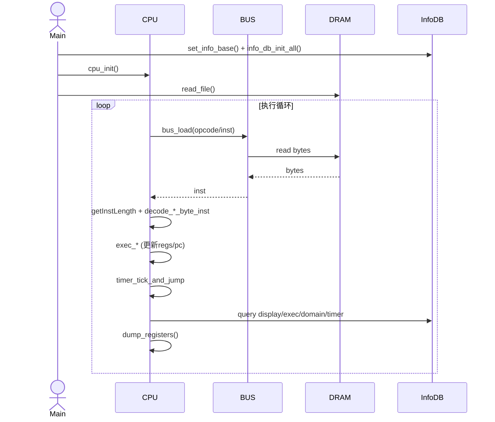
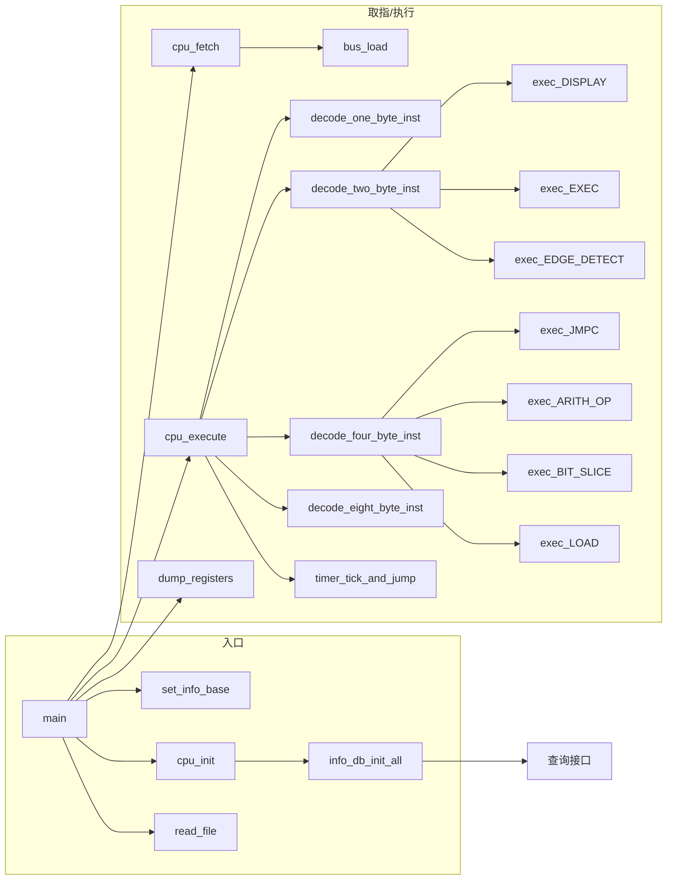
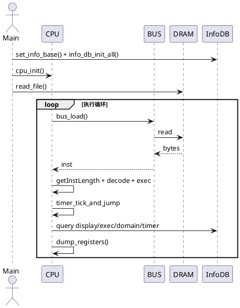
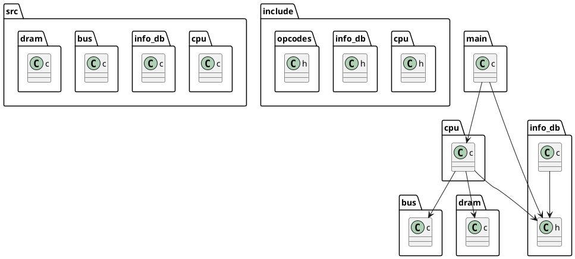
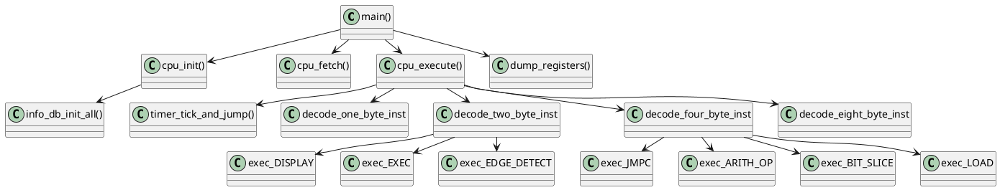

# TSL软核CPU代码框架设计

## 总体架构
- 目标：用纯C实现TSL软核CPU，提供取指、解码、执行、状态打印，以及外部信息库(DB)的装载与查询。
- 目录与模块：
  - `src/cpu.c`：CPU核心执行与调度（寄存器、PC、取指、解码、执行、日志/颜色）。入口参考：`src/cpu.c:397`
  - `src/dram.c`：DRAM读写与内存模型；入口参考：`src/dram.c:1`
  - `src/bus.c`：总线抽象（`bus_load/bus_store`）供CPU访问内存；入口参考：`src/bus.c`
  - `include/opcodes.h`：操作码常量定义；入口参考：`include/opcodes.h:4`
  - `src/info_db.c` + `include/info_db.h`：信息库加载与查询（`display/exec/domain/timer`）；入口参考：`src/info_db.c:1`
  - `main.c`：主程序入口，设置信息目录、加载二进制、执行主循环；入口参考：`main.c:71`

## 软核模型
- 寄存器
  - 数量与宽度：16个32位通用寄存器 `R0`–`R15`（`include/cpu.h:13`）
  - 约定：`R0`硬连常数0；`R15`作为返回地址寄存器（`exec_BL/exec_RET` 使用）
  - 历史寄存器：`prev_regs[16]` 保存上一拍值用于边沿检测（`src/cpu.c:843`）
- 程序计数器(PC)
  - `pc` 指向当前指令地址；每次取指后立即 `pc += inst_length`（`src/cpu.c:845`）
  - 跳转类指令在执行阶段对 `pc` 做相对修改（`exec_JMPC/exec_JMP/exec_BL`）
- 总线与内存
  - 总线接口：`bus_load/bus_store` 以位宽为单位读写（`src/cpu.c:372-378`）
  - DRAM：二进制加载到 DRAM 起始处（`main.c:53-56`），内存读写参考 `src/dram.c`
- 单周期模型
  - 指令执行以单周期抽象实现（不建流水），顺序执行；边沿检测基于 `prev_regs` 与当前 `regs` 的差分（`src/cpu.c:685-712`）

## 内存与地址空间
- DRAM 基址：`DRAM_BASE`（`include/dram.h`），`cpu.pc` 初始设为 DRAM 基址（`src/cpu.c:400`）
- 二进制加载：主程序将输入 `.bin` 写入 DRAM（`main.c:53-56`）
- 信号地址：示例信号表在 `src/cpu.c:25-37`，`load` 根据地址读取；未命中时返回0并打印错误（`src/cpu.c:39-46`）

## 指令集与编码
- 长度判定（`src/cpu.c:440-458`）：
  - 1字节：`trigger(0x3)`、`ret(0x8)`、`timer_set(0xF)`
  - 2字节：`trigger_pos(0x4)`、`jmp(0x5)`、`bl(0x9)`、`display(0xB)`、`domain_set(0xA)`、`exec(0xC)`、`edge_detect(0xE)`、`mov(func=1)`
  - 4字节：`jmpc(0x0)`、`arith_op(0x1)`、`bit_slice(0x6)`、`load(0xD)`
  - 8字节：`movi(0x7, func=0)`（`src/cpu.c:447-455`）
- 编码规则（参见 `doc/inst_format.md`）：
  - `jmpc`：[4 op][4 func][4 src1][4 src2][8 addr]
  - `arith_op`：[4 op][4 func][4 dst][4 src1][4 src2]
  - `bit_slice`：[4 op][4 dst][4 src][5 end][5 start]
  - `load`：[4 op][4 dst][24 addr]
  - `mov/movi`：`mov(func=1)` 2字节；`movi(func=0)` 8字节（`src/cpu.c:508-517`）
  - `edge_detect`：3bit `func` 支持 P/N/H/L/E（`src/cpu.c:685-712`）
  - `timer_set`：[id(1bit), func(2bit)]，保留位校验（`src/cpu.c:776-791`）

## 执行流程（逐指令）
- 主循环（`main.c:82-99`）：
  1. 设置信息目录 `set_info_base(argv[1])`（`main.c:64-73`）
  2. 初始化 CPU（`cpu_init`），装载四类 `.db`（`src/cpu.c:409-413` → `src/info_db.c:108-118`）
  3. 加载二进制到 DRAM（`main.c:53-56`）
  4. 循环：`cpu_fetch` → `cpu_execute` → `dump_registers`，遇 `pc==0` 或遇 `ret` 回主调时退出
- 取指（`src/cpu.c:465-474`）：
  - `getInstLength` 判定长度 → `bus_load` 按位宽取指令
- 解码分派（`src/cpu.c:839-846`）：
  - 保存 `prev_regs`，更新 `pc+=len`，分派至 `decode_*_byte_inst` → `exec_*`
- 关键指令执行
  - `exec_JMPC`（`src/cpu.c:210`）：比较或边沿条件；偏移为8bit有符号；满足条件则 `pc += offset`
  - `exec_ARITH_OP`（`src/cpu.c:267`）：支持 `& | ^ redu_and redu_or redu_xor concat isunknown add sub`，写回 `dst`
  - `exec_BIT_SLICE`（`src/cpu.c:334`）：（start,end）构掩码并提取位段，写回 `dst`
  - `exec_LOAD`（`src/cpu.c:361`）：按地址读取信号；打印取值；未命中返回0
  - `exec_MOV`（`src/cpu.c:398`）：寄存器到寄存器搬运
  - `exec_MOVI`（`src/cpu.c:173`）：校验 `func_bit==0`，写入立即数
  - `exec_TRIGGER_POS`（`src/cpu.c:410`）：设定采样范围
  - `exec_BL`（`src/cpu.c:418`）：`R15=pc` 保存返回地址；`pc+=offset(10bit)` 相对跳转
  - `exec_DOMAIN_SET`（`src/cpu.c:428`）：设域；打印 `get_domain_info()` 信息
  - `exec_JMP`（`src/cpu.c:439`）：8bit相对跳转
  - `exec_DISPLAY`（`src/cpu.c:448`）：按 `get_complete_display_string()` 打印完整格式
  - `exec_EDGE_DETECT`（`src/cpu.c:462`）：`func=P/N/H/L/E`，基于 `prev`/`curr`判断，写回 `dst`
  - `exec_TRIGGER`（`src/cpu.c:538`）：打印暂停采样提示
  - `exec_RET`（`src/cpu.c:544`）：`pc=R15` 返回地址，`R15=0`
  - `exec_TIMER_SET`（`src/cpu.c:551`）：按 `id/func(reset/enable/disable)` 更新计时器与计数器，打印 `get_timer_info()` 内容
- 计时器事件（`src/cpu.c:799` → `src/info_db.c:297`）：
  - `timer_tick_and_jump`：每指令周期调用；检查使能计时器，若达阈值则重置并尝试跳转至 `timer_target_pc`

## 信息库(DB)加载与格式
- 接口（`include/info_db.h:1-26`）：
  - `set_info_base(path)`：基于输入路径自动截取目录
  - `info_db_init_all()`：依次加载 display/exec/domain/timer 并打印总览
  - 查询：`get_display_format/get_complete_display_string/get_exec_info/get_domain_info/get_timer_info`
- 实现（`src/info_db.c:1-153`）：
  - `display_info.db`：解析格式字符串与整行内容(包含变量名)，一次性表构建；运行时直接查询与打印
  - `exec/domain/timer`：统一简单表解析 `{0xID, content}`，缺失时静默跳过
  - 启动打印示例：`DB载入【DISPLAY】19【EXEC】3【DOMAIN】3【TIMER】1`
- 示例格式
  - `display_info.db`：`{0x00000001, "concat result: %s", identifier reference: concat_result}, ...`
  - `exec_info.db`：`{0x00000001, debug_script.tcl}`
  - `domain_info.db`：`{0x00000002, [[0, "clk1"], [1, "clk2"]]}`
  - `timer_info.db`：`{0x00000000, ee6b2800, s2}`（示例语义：周期/标识等）

## 日志与颜色
- 开关：`set_ansi_color_enabled(int enabled)`（`include/cpu.h:32`）；关闭后日志为纯文本（无 `\x1b[...]` 控制序列）
- 机制：所有颜色通过 `print_color()` 输出；操作打印 `print_op()` 包裹颜色；参考：`src/cpu.c:12-21, 48-50`

## 容错与错误处理
- `.db` 文件缺失：仅打印错误或跳过加载，不中断执行（`src/info_db.c:33-39`）
- 未找到信号地址：打印提示并返回0，不触发断言（`src/cpu.c:39-46`）
- 开发模式断言：非法指令或编码错误处保留 `assert(0)`（例如 `exec_MOVI` 校验失败 `src/cpu.c:513-517`）；生产可改为错误码返回

## 时序图（单周期执行示意）

## 软核模型
- 指令宽度：1/2/4/8 字节混合；通过操作码高4位与MOV的func位区分长度。
- 寄存器：16个32位通用寄存器 `R0`–`R15`，`R15`为返回地址寄存器；`R0`硬连0；`prev_regs`保存上一拍用于边沿检测。
- 程序计数器：`pc` 指向当前指令地址；每次取指后先 `pc += inst_length`，分派执行。
- 总线：提供 `bus_load(addr, size)` 与 `bus_store(addr, size, value)`；CPU通过总线访问DRAM。
- 内存：模拟DRAM，地址基于 `DRAM_BASE`，二进制被加载到DRAM起始处。
- 单周期模型：每条指令视为单周期，顺序执行，不建流水/乱序；边沿检测基于 `prev_regs` 与当前寄存器快照差异。

## 指令集与编码
- 长度判定：`src/cpu.c:getInstLength()`
  - 1字节：`trigger(0x3)`、`ret(0x8)`、`timer_set(0xF)`
  - 2字节：`trigger_pos(0x4)`、`jmp(0x5)`、`bl(0x9)`、`display(0xB)`、`domain_set(0xA)`、`exec(0xC)`、`edge_detect(0xE)`、`mov(func=1)`
  - 4字节：`jmpc(0x0)`、`arith_op(0x1)`、`bit_slice(0x6)`、`load(0xD)`
  - 8字节：`movi(0x7, func=0)`

- 编码规则(参见 `doc/inst_format.md`)：
  - `jmpc`：[4 op][4 func][4 src1][4 src2][8 addr]
  - `arith_op`：[4 op][4 func][4 dst][4 src1][4 src2]
  - `bit_slice`：[4 op][4 dst][4 src][5 end][5 start]
  - `load`：[4 op][4 dst][24 addr]
  - `mov/movi`：`mov(func=1)` 2字节；`movi(func=0)` 8字节
  - `edge_detect`：3bit func 支持 P/N/H/L/E
  - `timer_set`：[id(1bit), func(2bit)]，保留位校验

## 执行流程
- 主循环：`main.c`
  1. 设置信息库基目录 `set_info_base(argv[1])`。
  2. 初始化CPU `cpu_init` → `info_db_init_all` 加载各 `.db`。
  3. 将 `.bin` 读入DRAM。
  4. 循环：`cpu_fetch` → `cpu_execute` → `dump_registers`；遇 `pc == 0` 或 `ret` 返回主调时退出。

- 取指：`cpu_fetch(CPU* cpu, uint8_t* inst_length)`
  - 通过 `getInstLength` 判定长度；从DRAM取指令字节。

- 解码分派：`cpu_execute`
  - 保存 `prev_regs` 快照
  - 根据 `inst_length` 分派到 `decode_one/two/four/eight_byte_inst`，再调用对应的 `exec_*`
  - 调用 `timer_tick_and_jump` 处理计时器事件

- 指令执行函数(部分)：
  - `exec_JMPC(CPU*, uint32_t)`：解析比较/边沿检测；符号扩展8bit偏移；条件满足则 `pc += offset`。
  - `exec_ARITH_OP(CPU*, uint32_t)`：实现 `& | ^ redu_and redu_or redu_xor concat isunknown add sub`；打印助记与寄存器名。
  - `exec_BIT_SLICE(CPU*, uint32_t)`：生成掩码并提取位段到 `dst`。
  - `exec_LOAD(CPU*, uint32_t)`：按地址加载信号变量到寄存器；未找到信号返回0并打印错误。
  - `exec_MOV(CPU*, uint16_t)`：寄存器到寄存器赋值。
  - `exec_MOVI(CPU*, uint64_t)`：立即数写寄存器；校验 `func_bit==0`。
  - `exec_TRIGGER_POS(CPU*, uint16_t)`：设定采样范围。
  - `exec_BL(CPU*, uint16_t)`：保存返回地址至 `R15` 并相对跳转(10bit符号)。
  - `exec_DOMAIN_SET(CPU*, uint16_t)`：写入域；查询 `domain_info.db` 打印说明。
  - `exec_JMP(CPU*, uint16_t)`：8bit符号相对跳转。
  - `exec_DISPLAY(CPU*, uint16_t)`：查询 `display_info.db` 按格式字符串打印完整内容。
  - `exec_EDGE_DETECT(CPU*, uint16_t)`：基于 `prev_regs`/当前值与 `func` (P/N/H/L/E) 写结果到 `dst`。
  - `exec_TRIGGER(CPU*, uint8_t)`：打印暂停与采样提示。
  - `exec_RET(CPU*, uint8_t)`：将 `pc` 设置为 `R15` 返回地址并清零 `R15`。
  - `exec_TIMER_SET(CPU*, uint8_t)`：按 `id/func` 重置/启停计数器，打印 `timer_info.db` 信息。

## 信息库(DB)加载
- 接口：`include/info_db.h`
  - `set_info_base`：根据二进制路径截取目录。
  - `info_db_init_all`：分别加载 `display/exec/domain/timer`，总览打印“DB载入【DISPLAY】【EXEC】【DOMAIN】【TIMER】”。
  - `get_display_format/get_complete_display_string/get_exec_info/get_domain_info/get_timer_info`：按ID查询。
- 实现：`src/info_db.c`
  - `display_info.db`：解析格式字符串与整行内容(包含变量)，一次性表构建，运行时直接查询。
  - 其他 `.db`：统一简单表解析，保存ID与内容字符串；缺失文件时静默跳过。

## 日志与颜色
- 颜色开关：`set_ansi_color_enabled(int enabled)`；日志文件默认不含ANSI颜色，当重定向到文件建议关闭。
- 打印函数：所有颜色输出通过 `print_color` 控制；操作打印使用 `print_op` 包裹颜色码。

## 容错与错误处理
- `.db` 文件缺失：仅打印错误或跳过加载，不中断执行。
- 未找到信号地址：打印提示并返回0，不触发断言。
- 解码与执行遇到非法字段：保留打印错误并 `assert(0)` 的开发模式；如需生产容错可改为返回错误码并继续。

## 代码入口与参考
- CPU初始化：`src/cpu.c:397`
- 取指与执行：`src/cpu.c:465-474`、`src/cpu.c:839-846`、分派：`src/cpu.c:714-756 / 793-812 / 419-557`
- 主要指令执行：
  - `jmpc`：`src/cpu.c:210`
  - `arith_op`：`src/cpu.c:267`
  - `bit_slice`：`src/cpu.c:334`
  - `load`：`src/cpu.c:361`
  - `mov(2B)`：`src/cpu.c:398`
  - `movi(8B)`：`src/cpu.c:173`
  - `edge_detect`：`src/cpu.c:462`
  - `timer_set`：`src/cpu.c:551`
- 信息库加载：`src/info_db.c`；接口：`include/info_db.h`

## 时序图（单周期执行示意）
```
时间 --->

取指阶段:   [PC取指]----(bus_load)---->[指令字节]
             |                               
             +--> prev_regs <= regs 快照

解码阶段:   [长度判定] -> [按长度分派] -> [解析字段(opcode/func/rd/rs/imm...)]

执行阶段:   [exec_* 函数] -> [ALU/位运算/位截取/比较/边沿检测]
             |                 |             |             |
             |                 +--> regs[dst] 写回          
             |                 +--> 条件满足时 pc += offset (JMPC/JMP/BL)

后处理:     [timer_tick_and_jump] -> [更新计时器/检查跳转]

写回阶段:   [更新寄存器/域/计时器/状态] -> [dump_registers]

说明：单周期模型中每条指令顺序完成上述步骤；边沿检测使用 prev_regs 与当前 regs 的差分；跳转指令在执行阶段直接修改 pc（相对偏移）。
```

## 伪代码流程
```
main():
  if argc != 2: print usage; exit
  set_info_base(argv[1])              // 基于输入路径设置信息库目录
  cpu_init(cpu)                       // 初始化寄存器、PC、并 info_db_init_all()
  read_file(cpu, argv[1])             // 将二进制写入 DRAM
  while true:
    inst_length = getInstLength(cpu)  // 基于 opcode 与 MOV 的 func 位
    inst        = cpu_fetch(cpu, &inst_length)
    if !cpu_execute(cpu, inst, inst_length): break
    dump_registers(cpu)
    if cpu.pc == 0: break

cpu_execute(cpu, inst, inst_length):
  print("\n%08x ->", cpu.pc) with optional color
  prev_regs = regs (snapshot)
  cpu.pc += inst_length
  switch inst_length:
    case 1: return decode_one_byte_inst(cpu, inst)
    case 2: return decode_two_byte_inst(cpu, inst)
    case 4: return decode_four_byte_inst(cpu, inst)
    case 8: return decode_eight_byte_inst(cpu, inst)
    default: error
  timer_tick_and_jump(cpu)

decode_two_byte_inst(cpu, inst16):
  opcode = (inst16 >> 12) & 0xF
  switch opcode:
    0x4: exec_TRIGGER_POS
    0x5: exec_JMP
    0x7: exec_MOV
    0x9: exec_BL
    0xA: exec_DOMAIN_SET
    0xB: exec_DISPLAY
    0xC: exec_EXEC
    0xE: exec_EDGE_DETECT

exec_JMPC(cpu, inst32):
  func   = (inst32 >> 24) & 0xF
  src1_r = (inst32 >> 20) & 0xF
  src2_r = (inst32 >> 16) & 0xF
  addr_u = (inst32 >> 8)  & 0xFF
  off    = sign_extend_8(addr_u)
  s1 = regs[src1_r]; s2 = regs[src2_r]
  should_jump = eval_condition(func, s1, s2, prev_regs)
  if should_jump: cpu.pc += off
  return 1

exec_ARITH_OP(cpu, inst32):
  func = (inst32 >> 24) & 0xF
  dst  = (inst32 >> 20) & 0xF
  s1r  = (inst32 >> 16) & 0xF
  s2r  = (inst32 >> 12) & 0xF
  s1 = regs[s1r]; s2 = regs[s2r]
  switch func:
    and/or/xor: regs[dst] = s1 op s2
    redu_*    : regs[dst] = reduction_bits(s1)
    concat    : regs[dst] = concat16(s1[15:0], s2[15:0])
    isunknown : regs[dst] = 0/1 (示例实现)
    add/sub   : regs[dst] = s1 +/- s2
  return 1
```

## 函数调用关系图（核心路径）
```
main.c
  └─ main
      ├─ set_info_base
      ├─ cpu_init
      │   └─ info_db_init_all
      │       ├─ init_display_info_table
      │       ├─ init_exec_info_table
      │       ├─ init_domain_info_table
      │       └─ init_timer_info_table
      ├─ read_file
      └─ while {...}
          ├─ cpu_fetch
          │   └─ bus_load
          ├─ cpu_execute
          │   ├─ decode_one_byte_inst
          │   │   ├─ exec_TRIGGER
          │   │   ├─ exec_RET
          │   │   └─ exec_TIMER_SET
          │   ├─ decode_two_byte_inst
          │   │   ├─ exec_TRIGGER_POS
          │   │   ├─ exec_JMP / exec_BL / exec_DOMAIN_SET
          │   │   ├─ exec_DISPLAY (调用 get_complete_display_string)
          │   │   ├─ exec_EXEC (调用 get_exec_info)
          │   │   └─ exec_EDGE_DETECT
          │   ├─ decode_four_byte_inst
          │   │   ├─ exec_JMPC
          │   │   ├─ exec_ARITH_OP
          │   │   ├─ exec_BIT_SLICE
          │   │   └─ exec_LOAD
          │   ├─ decode_eight_byte_inst
          │   │   └─ exec_MOVI
          │   └─ timer_tick_and_jump
          └─ dump_registers

信息库(info_db)
  ├─ set_info_base
  ├─ info_db_init_all
  │   ├─ init_display_info_table
  │   ├─ init_exec_info_table
  │   ├─ init_domain_info_table
  │   └─ init_timer_info_table
  └─ 查询接口
      ├─ get_display_format / get_complete_display_string
      ├─ get_exec_info
      ├─ get_domain_info
      └─ get_timer_info
```

## 进一步说明
- 边沿检测：`func`=0/1/2/3/4 映射为 P/N/H/L/E；使用 `prev_regs[src]` 与 `regs[src]` 的差分。
- 跳转偏移：`jmp/jmpc/bl` 使用 8/10bit 有符号偏移，立即在执行阶段对 `pc` 进行修改。
- DB 打印：启动时打印“DB载入【DISPLAY】【EXEC】【DOMAIN】【TIMER】”，方便确认四类 `.db` 加载情况。
- 计时器：执行每条指令后，`timer_tick_and_jump` 更新活跃计时器；若达阈值，重置计时器并根据 `timer_info.db` 中的目标 PC 跳转。

## 性能与扩展建议
- 解码表驱动：用结构化“操作码→长度→执行函数”表替代 `switch`，提高扩展性与可读性。
- 指令助记映射：为 `arith_op.func` 映射人类可读助记（`and/or/xor/redu_* /concat/isunknown/add/sub`），便于反汇编工具展示。
- 计时器/域联动：在执行循环中模拟周期累积与多域采样窗，为 `timer_set/domain_set` 提供更真实时序语义。
- 工具脚本：`scripts/BinToAsm.py` 与 `scripts/BinToMem.py` 已对齐 ISA，可继续加入助记名映射与更严格的格式化。

## 测试与调试建议
- 单元测试：为 `exec_*` 的关键语义（`jmpc` 条件与偏移、`edge_detect` 五模式、`bit_slice` 掩码边界、`arith_op` 全分支）增加测试用例。
- 反汇编对齐测试：确保 `BinToAsm` 输出与 `.diss` 一致，包含偏移、寄存器名与助记符。
- 日志规范：在文件输出场景默认关闭ANSI颜色；控制台运行可开启以提高可读性。

## Mermaid 图表

### 单周期时序图


### 主循环流程图
```mermaid
flowchart TD
    A[main(argv)] --> B[set_info_base]
    B --> C[cpu_init]
    C --> D[info_db_init_all]
    D --> E[read_file]
    E --> F{循环}
    F -->|fetch| G[getInstLength + bus_load]
    G --> H[decode_*_byte_inst]
    H --> I[exec_*]
    I --> J[timer_tick_and_jump]
    J --> K[dump_registers]
    K --> F
    F -->|pc==0 或 ret| L[退出]
```

### 函数调用关系图


## PlantUML 图表

### 单周期时序图


## 架构总览图（Image）
- 以下为整体架构示意图的嵌入位点（PNG/SVG皆可）：


- 建议用上述 PlantUML/mermaid 代码生成图像文件并存放到 `doc/images/` 目录，文件名建议：
  - `tsl_architecture.png`：模块关系与数据通路总览
  - `tsl_flow.png`：主循环与指令执行流程总览
- 生成参考（示例）：
  - PlantUML：`plantuml -tpng doc/TSL软核CPU代码框架设计.md`（或将代码片段保存为 `.puml` 再生成）
  - Mermaid：`mmdc -i flow.mmd -o doc/images/tsl_flow.png`

### 模块关系图


### 调用关系图（核心路径）


## 未来工作
- 指令表驱动的解码器：以表+函数指针替代 `switch`，便于扩展与维护。
- `arith_op` 助记映射：将func编号映射到人类可读名称(`add/sub/concat/isunknown/redu_*`)。
- 计时器/域行为深化：将计数器与采样窗口融入执行循环，体现域与时序语义。
- 单元测试与CI：为指令执行与DB解析增加自动测试与覆盖率。
