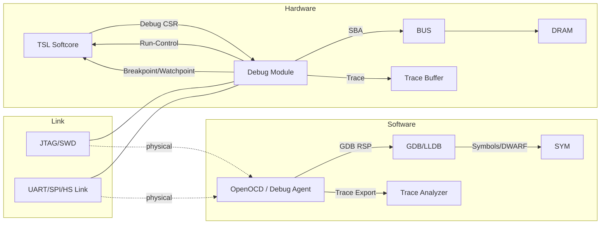
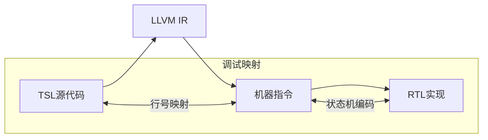
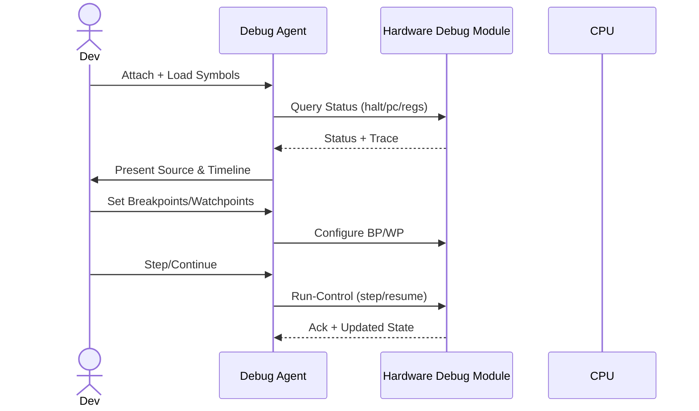

# TSL软核CPU软硬结合调试器设计文档

## 目标与原则
- 目标：构建一个软硬协同的调试体系，当硬件运行出现问题时，能实时 halt/step/trace、读取现场、源级分析与修复；同时在软件仿真环境提供同样接口以统一脚本与工具链。
- 原则：
  - 非侵入、低延迟：断点/观察点与 trace 尽量硬件实现，不替换用户指令。
  - 接口统一：硬件与仿真使用相同的调试协议，脚本一次编写，两端通用。
  - 安全与可控：生产环境禁用或授权启用调试通路，避免泄漏与滥用。

## 总体架构
- 硬件调试模块（位于软核CPU与系统总线侧）：Run-Control、断点/观察点、Bus Master、触发/cross-trigger、trace 缓冲。
- 软件调试器（位于主机端）：协议桥接（OpenOCD/自研 Debug Agent）、源级调试（GDB/LLDB）、trace 解码、脚本化自动化。

### Mermaid 架构图


## 硬件调试模块设计
### Run-Control
- 能力：`halt/resume/single-step`、进入/退出 debug 模式、记录原因码（断点命中、观察点命中、异常、软件触发）。
- 行为：halt 时冻结流水/状态；单步执行一条指令后自动回到 halt；resume 恢复正常执行。

### 断点/观察点
- 断点（PC 比较器）：N 个硬件断点（如 4 个），支持地址匹配与掩码；命中后触发 halt 或 trace dump。
- 观察点（地址/数据比较器）：跟踪总线读写，条件命中触发动作（halt/trace/event）。

### 系统总线访问（SBA）
- Bus Master：在 halt 状态下独立访问系统内存（读写 DRAM），不影响 CPU 正常访问；提供地址、大小、数据寄存器与完成标志。

### 触发与交叉触发
- 触发源：断点命中、观察点命中、异常、计数器阈值、外部事件。
- 动作：halt、trace dump、事件计数、跨模块触发（如总线错误触发 CPU halt）。

### Trace（ETB/ETM/ITM 简化）
- 分支/指令 trace：记录 PC 流与分支方向，附时间戳；可选记录事件（显示/执行/域/计时器）。
- 存储：片上环形缓冲（ETB），支持读取与清空；高带宽场景可流式输出到主机。

### Debug CSR 空间（示意）
- `DBG_CTRL`：bit0 halt, bit1 step, bit2 resume, bit3 debug_mode, bit[7:4] reason_code
- `DBG_STATUS`：当前 PC、寄存器快照可读；trace 可用标志
- `BP[i]`：断点配置（地址、掩码、动作）
- `WP[i]`：观察点配置（地址、宽度、读/写、动作）
- `SBA_ADDR / SBA_SIZE / SBA_DATA / SBA_CTRL`：系统总线访问
- `TRACE_CTRL / TRACE_STATUS / TRACE_READ`：trace 控制与读取接口

### 硬件实现细节
- 非侵入式探针网络：在关键信号上插入只读探针与比较器，支持断点触发与状态采样。
```
module debug_probe(
  input  clk,
  input  [31:0] pc,
  input  [63:0] regfile,
  input  trigger_active,
  output reg debug_break
);
  always @(posedge clk) begin
    if (pc == debug_bp_addr && bp_enabled)
      debug_break <= 1'b1;
  end
endmodule
```
- 实时追踪缓冲区：使用片上 BRAM 构建环形缓冲，存储最近 N 周期的 PC、寄存器快照、触发状态与内存访问记录；支持指针读出与清空。
- 异常捕获单元：实时检测未定义指令、内存访问越界、触发条件冲突、状态机死锁，进入 debug 模式并记录原因码。

### 调试寄存器地址示例
| 地址 | 名称 | 功能 |
|------|------|------|
| `0x1000` | `DBG_CTRL` | 调试使能/断点控制/step/resume |
| `0x1004` | `DBG_PC` | 当前 PC 值只读 |
| `0x1008` | `DBG_BP_ADDR` | 断点地址配置 |
| `0x1010` | `DBG_TRACE_PTR` | 追踪缓冲读指针 |

### 物理链路
- JTAG/SWD：成熟，生态完善（OpenOCD）；带宽较低但足够 Run-Control 与小规模 trace。
- UART/SPI/高速链路：用于高带宽 trace 与快速导出；复杂度更高，资源占用更大。

#### 接口选择对比
| 接口类型 | 带宽 | 延迟 | 适用场景 |
|----------|------|------|----------|
| JTAG | ~10 Mbps | 高 | 基础调试、现场诊断 |
| USB 3.0 | 5 Gbps | 中 | 实时数据流/trace 导出 |
| PCIe 4.0 | 16 Gbps | 低 | 高性能调试（首选） |
| Ethernet (1G/10G) | 1–10 Gbps | 可变 | 远程调试/分布式采集 |

## 软件调试器设计
### 协议桥接
- OpenOCD/自研 Debug Agent：下行接 JTAG/UART 等物理链路，上行提供 GDB RSP（Remote Serial Protocol）。
- 命令映射：
  - `? / g / G`：状态查询、寄存器读写 → 读写 Debug CSR/寄存器窗口
  - `m / M`：内存读写 → SBA 命令
  - `Z0 / z0`：硬件断点设置/清除 → 写断点寄存器
  - `Z2 / z2`：观察点设置/清除 → 写观察点寄存器
  - `c`：继续 → resume
  - `s`：单步 → step

### 调试协议扩展（TSL 专用）
```
#define TSL_DEBUG_GET_TRACE 0xD0
#define TSL_DEBUG_SET_BP    0xD1
#define TSL_DEBUG_READ_CSR  0xD2

struct tsl_debug_frame {
  uint8_t  cmd;
  uint32_t length;
  uint8_t  payload[256];
  uint32_t crc;
};
```

### FPGA 端调试服务
- 片上软核/控制器解析调试帧；将调试寄存器映射到总线；管理 trace 缓冲读取与传输。

### 源级调试与 trace
- 符号加载：ELF + DWARF；显示源文件、行号、变量；支持栈回溯。
- Trace 解码：分支/事件 trace 解出时间线；映射到源码；支持过滤与统计。

### 跨层级调试映射


### IDE 集成功能
- 源代码级断点、时钟周期级单步、变量监视（寄存器/内存）。
- 波形调试：实时信号波形、触发事件标记、时序违规检测。
- 性能分析：事件统计、状态机停留时间、关键路径分析。

### 自动化与脚本
- Python/TCL 脚本：批量断点、窗口配置、用例执行、故障复现；统一脚本适配仿真与硬件。

## 工作流（软硬协同）
1. 故障发生：硬件断点/观察点/异常触发 → CPU 进入 debug 模式 → 现场冻结（PC/寄存器/trace）。
2. 主机连接：OpenOCD/Debug Agent 附加 → 读取现场与符号 → 源级定位。
3. 调试操作：单步、修改寄存器/内存、重放 trace、条件断点；脚本化自动化复现与采样。
4. 修复与继续：场景验证通过，resume 继续运行；必要时导出现场与报告。

### Mermaid 调试工作流


## 关键技术实现细节
- 零干扰调试：影子寄存器用于读取现场，避免影响主流水；必要时使用部分重配置插入/移除调试逻辑；调试时钟域与主时钟域隔离。
- 实时追踪压缩：对 PC/事件序列采用 delta/重复计数编码，降低带宽与存储压力。
```
原始序列：PC=100, 102, 102, 102, 105, 105...
压缩后：100, +2, *3, +3, *2...
```
- 智能错误诊断：基于规则与统计的快速诊断，必要时结合模型对复杂故障进行分类与定位。

## 与仿真器的统一
- 在 `tsl_cpu_emulator` 中加入 RSP stub，使仿真器暴露与硬件一致的调试接口：
  - 寄存器/内存读写：直接访问 CPU 结构与 DRAM
  - 断点/观察点：软件模拟（替换指令或条件断点）
  - 单步：一次 `cpu_execute`
- Trace：记录指令与事件序列
- 统一脚本与工具：同一套 GDB/脚本，在仿真与硬件两端一致工作；提升问题复现效率。

## 性能优化策略
- 选择性追踪：仅在关键寄存器/PC 变化时记录，降低写入频率。
```
always @(posedge clk) begin
  if (reg_file[0] != last_reg0) begin
    trace_buf[ptr] <= reg_file;
    ptr <= ptr + 1;
  end
end
```
- 分层调试：
  - Level 0：仅 PC 追踪
  - Level 1：PC + 寄存器
  - Level 2：全状态追踪
- 片上预处理：在 FPGA 端进行初步错误检测，仅传输异常上下文以节流。

## 实施路线图
- 阶段1（最小可用）
  - 硬件：Run-Control（halt/step/resume）、2~4 个硬件断点/观察点、SBA 内存访问、Debug CSR 映射、JTAG 接入。
  - 软件：OpenOCD/自研 Agent 基础命令映射、GDB 源级调试。
- 阶段2（增强）
  - 硬件：分支/事件 trace + ETB；触发/交叉触发；异常进入 debug 模式；性能计数器。
  - 软件：Trace 导出与时间轴分析；脚本化自动化与批量用例。
- 阶段3（成熟）
  - 高速链路（可选）；高级 trace（压缩/过滤/时间戳）；安全与鉴权；与CI/实验框架联动。

## 安全与量产
- 生产禁用或授权启用调试通路；Debug CSR 与链路加密/鉴权；构建区分开发/量产版本；审计日志记录。

## 接口与寄存器（示例表）
- `DBG_CTRL`: [halt|step|resume|debug_mode|reason]
- `DBG_STATUS`: [pc|flags|trace_avail]
- `BP[i]`: [addr|mask|action]
- `WP[i]`: [addr|width|rw|action]
- `SBA_ADDR/SIZE/DATA/CTRL`: [addr|len|data|go/done]
- `TRACE_CTRL/STATUS/READ`: [enable|depth|read_ptr]

## 与现代处理器技术的关联
- ARM CoreSight：Run-Control + ETM/ITM + ETB + Cross Trigger Matrix → 参考结构与触发机制。
- RISC‑V Debug Module：halt/resume、abstract commands、system bus access → 参考接口与协议。

## 集成建议与下一步
- 优先落地最小硬件调试模块与主机桥接；同时在 `tsl_cpu_emulator` 加入 RSP stub 统一接口。
- 建立调试测试集：断点/观察点、trace、异常现场；形成自动化脚本与报告输出。
- 持续完善：计时器/域的时序语义、trace 压缩与过滤、性能采样与可视化。

## 部署建议
- 关键验证阶段：将调试模块集成在 FPGA 逻辑中以获得实时可视性。
- 日常开发：通过 PCIe/USB 高速链路连接，进行高带宽 trace 与分析。
- 量产调试：保留 JTAG 接口用于现场诊断，结合授权与审计，确保安全可控。
